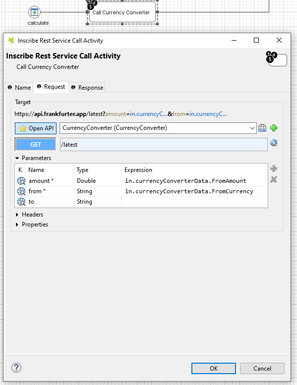
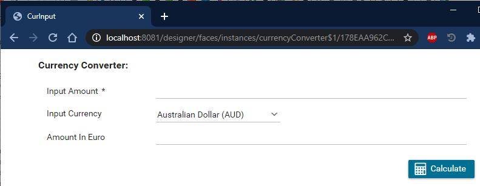

# Währung #Umwandler API

#Axon Efeus [Frankfurter](https://www.frankfurter.app) Währung #Daten API
Anschluss hilft du zu beschleunigen Arbeitsgang Automatisierung Initiativen
umrechnen mal Währungen von #man zu anderer.

Der Anschluss:

* Bietet verschiedene Währung Raten gegründet wie späteste Raten, historische
  Raten, Zeit Folge und More.
* Unterstützt du mit ein leichtes-zu-Kopie Demo Ausführung zu heruntersetzen
  eure Integration Anstrengung.
* Aktiviert niederen Code Bürger Entwickler zu erweitern existieren dienstliche
  Arbeitsgänge mit Währung #Umwandler Charakterzüge.

## Demo

### API Anruf

### Beispiel: #Einlesen #Formen

